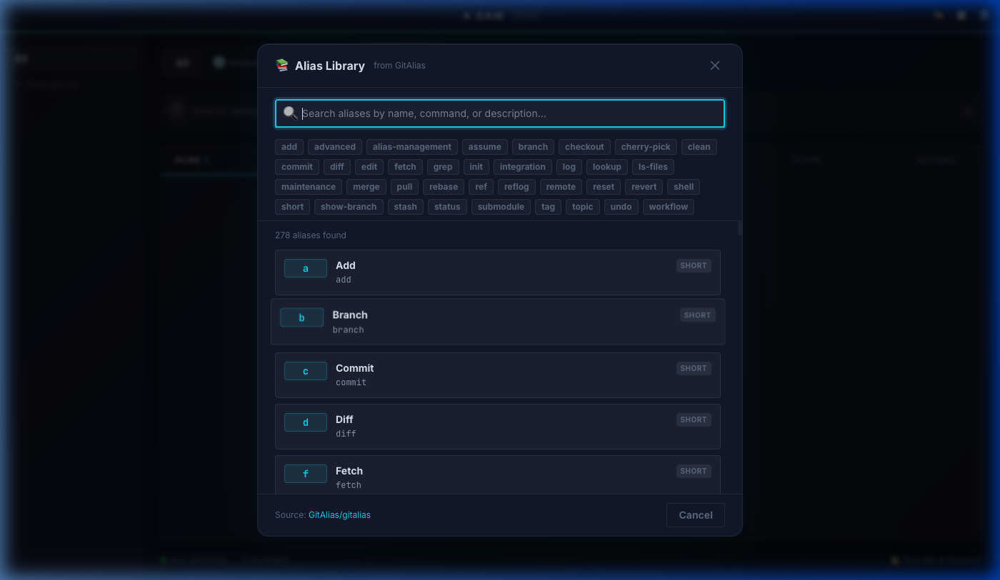
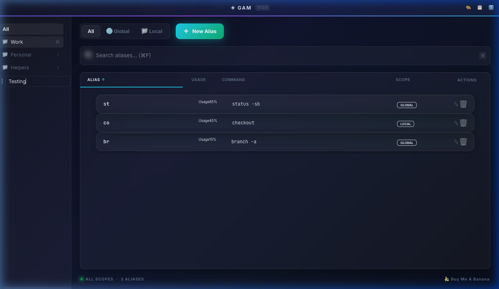
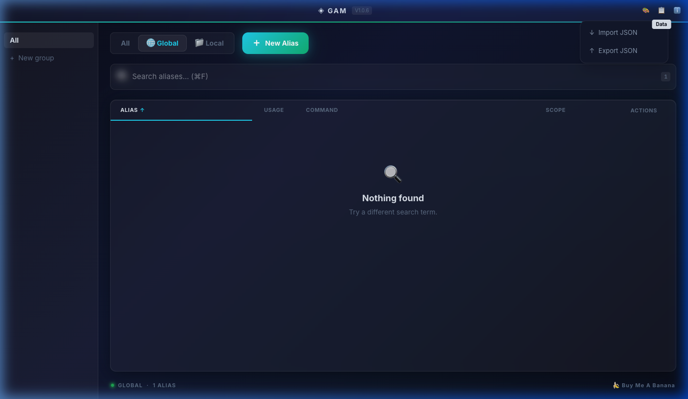
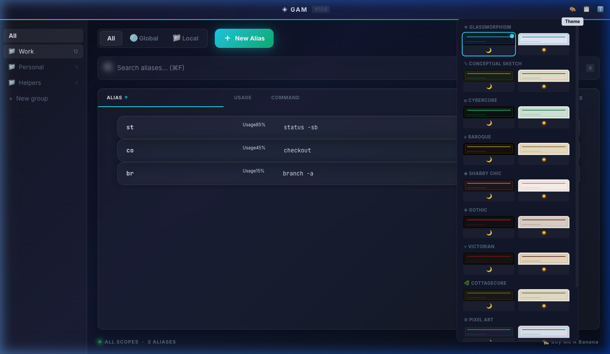

# GAM — User Manual

GAM (Git Alias Manager) is a desktop app for managing Git aliases across global and local scopes.
This manual covers every feature.

## 1. Alias List

The main view is a sortable table of all your Git aliases.

- **Scope toggle** — Switch between `Global` (`~/.gitconfig`), `Local` (`.git/config`), or `All` via the toolbar pill-switch.
- **Clear local folder** — Click `✕` next to the repo badge to show all cached local aliases at once.
- **Rank sorting** — Click the `⭐` column header to rank aliases by usage. GAM reads your shell history (zsh, bash, Fish, PowerShell) and scores by `TimeMultiplier × Length^(3/5) × Frequency`.
- **Search** — `⌘F` / `Ctrl+F` opens instant search. Matches against alias name and command.
- **Scope links** — Local aliases show their repo path in the Scope column. Click to open the folder in your OS file manager.

## 2. Create & Edit Aliases

Click **+ Add Alias** in the toolbar.

- **Command** — Type the Git command without the `git` prefix. A live preview shows the final call.
- **Name** — Choose a short alias name to invoke the command.
- **Suggestions** — GAM auto-suggests names using 5 schemes: Semantic, Abbreviation, Vowel Removal, First-Letter Combo, Smart Truncation. Click any chip to use it.
- **Validation** — Dangerous operations (`rm -rf`, `push --force`, `reset --hard`) are flagged with warnings.
- **Scope change** — Editing a Global alias and switching scope to Local will create a duplicate bound to the local repo instead of overwriting the global one.

## 3. Alias Library

Click **📚 Browse Alias Library** in the create/edit form to browse **270+ predefined aliases** from [GitAlias](https://github.com/GitAlias/gitalias).

- **Search** — Filter by name, command, or description.
- **Category chips** — Filter by function area (`branch`, `commit`, `log`, `workflow`, etc.).
- **One-click select** — Click any card to populate both fields. Name stays editable.
- **Multi-line** — The command textarea supports multi-line shell-function aliases.

## 4. Alias Groups

Organize aliases into color-coded groups for quick filtering.

- **Create a group** — Click **+ New group** at the bottom of the group sidebar. Pick a name and color.
- **Rename** — Double-click any group name to edit it inline. Press Enter to confirm, Escape to cancel.
- **Delete** — Hover over a group and click `✕`. Assignments to that group are automatically cleaned up.
- **Filter** — Click a group to filter the alias list. Click **All** to remove the filter.
- **Alias count** — Each group shows the number of aliases assigned to it.
- **Export/Import** — Groups and their alias assignments are included in JSON exports. Importing a file with groups auto-merges them into your existing groups.

## 5. Import & Export

Use the **Data dropdown** in the toolbar:

- **Export** — Saves all aliases (plus groups and assignments) to a `.json` file.
- **Import** — Loads aliases from a `.json` file. Groups are automatically merged if present.
- **Drag & drop** — Drop a folder onto the app to set the local repo path.

## 6. Themes

GAM includes **10 visual styles × 2 modes = 20 themes**. Open Settings (gear icon) → Theme to browse:

| Style         | Description                     |
| ------------- | ------------------------------- |
| Glassmorphism | Frosted glass with blur effects |
| Sketch        | Notebook / hand-drawn aesthetic |
| Cybercore     | Neon glow, digital grids        |
| Baroque       | Ornate, classical ornamentation |
| Shabby        | Distressed, vintage textures    |
| Gothic        | Dark, dramatic atmosphere       |
| Victorian     | Elegant serif typography        |
| Cottagecore   | Warm, natural palette           |
| Pixel         | Retro 8-bit aesthetic           |
| Filigree      | Delicate metallic patterns      |

Each style is available in **Light** and **Dark** modes. Theme selection is persisted across sessions.

## 7. Auto-Update

GAM checks for updates on every launch. When a new version is available:

1. A modal shows the changelog (pulled from GitHub Releases).
2. Click **Download & Install** to update in-place, or **Skip** to dismiss.
3. The app restarts automatically after installation.

## 8. Keyboard Shortcuts

| Shortcut        | Action                     |
| --------------- | -------------------------- |
| `⌘F` / `Ctrl+F` | Focus search bar           |
| `Escape`        | Close modal / clear search |

Modifier keys adapt to your platform: `⌘` on macOS, `Ctrl` on Linux/Windows.

## 9. Data & Crash Logs

All persistent data is stored via the OS data directory:

| Platform | Path                                                    |
| -------- | ------------------------------------------------------- |
| macOS    | `~/Library/Application Support/com.github.zintaen.gam/` |
| Linux    | `~/.local/share/com.github.zintaen.gam/`                |
| Windows  | `%APPDATA%/com.github.zintaen.gam/`                     |

Files: `settings.json`, `known-repos.json`, `groups.json`

Crash logs (Rust panics): `~/.gam/crash.log`

---

## 🍌 Support

If GAM saves you time, consider fueling its development with a banana!

Or scan the QR Code:

