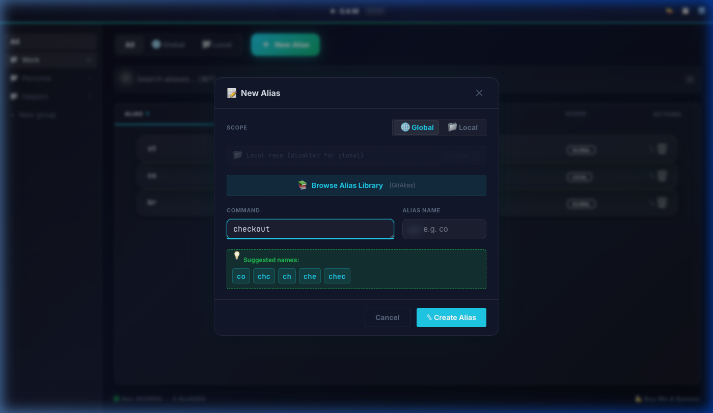

<div align="center">

# GAM — Git Alias Manager

**A professional desktop GUI for managing Git aliases across Windows, Linux, and macOS.**

[](https://github.com/zintaen/gam)

[](./LICENSE)
[](https://tauri.app/)
[](https://react.dev/)
[](https://www.typescriptlang.org/)

<br/>


</div>

---

## ✨ Features

| Feature                           | Description                                                                                                                               |
| --------------------------------- | ----------------------------------------------------------------------------------------------------------------------------------------- |
| 🔍 **Searchable Alias List**      | Sort by name, command, or scope. Filter with ⌘F instant search.                                                                           |
| 🏆 **Usage Ranking**              | Aliases ranked by a smart scoring algorithm — prioritizes recently and frequently used commands.                                          |
| 📚 **Alias Library**              | Browse 270+ predefined aliases from [GitAlias](https://github.com/GitAlias/gitalias). Search, filter by category, and add with one click. |
| 💡 **Alias Suggestions**          | Auto-generates alias name candidates using 5 intelligent schemes when creating new aliases.                                               |
| ✏️ **Create & Edit**              | Modal form with real-time validation, live command preview, and smart suggestions.                                                        |
| 🗑 **Safe Delete**                | Confirmation dialog before every destructive action.                                                                                      |
| ⚠️ **Dangerous Command Warnings** | Flags `push --force`, `rm -rf`, `reset --hard`, and shell aliases.                                                                        |
| 🌐 **Scope Toggle**               | Switch between Global, Local, and All scopes.                                                                                             |
| 📦 **Import / Export**            | Share alias collections as JSON files.                                                                                                    |
| 🛡 **Auto-Backup**                | Backs up `~/.gitconfig` before every write operation.                                                                                     |
| ⌨️ **Keyboard Shortcuts**         | ⌘F to search, Escape to close modals.                                                                                                     |
| 🚀 **Ultra Modern UI**            | Deep space gradients, dynamic glassmorphism, animated glow effects, and smooth micro-animations.                                          |

---

## 🧠 Ranking Algorithm

GAM uses a scoring algorithm (inspired by [alman](https://github.com/vaibhav-mattoo/alman/)) to rank aliases by how useful they are to you:

```
Score = TimeMultiplier × Length^(3/5) × Frequency
```

### Time-Based Multipliers

| Recency  | Multiplier |
| -------- | ---------- |
| ≤ 1 hour | 4.0×       |
| ≤ 1 day  | 2.0×       |
| ≤ 1 week | 0.5×       |
| > 1 week | 0.25×      |

- **Frequency** — More frequently used aliases score higher
- **Recency** — Recently used aliases get a significant boost
- **Length** — Longer commands score slightly higher (saving more keystrokes)
- **Auto-Reset** — When total score exceeds 70,000, all frequencies are halved to prevent inflation

Toggle between **A-Z** (alphabetical) and **🏆 Rank** sorting in the alias list. Usage is tracked automatically when you copy an alias command.

---

## 🎯 Alias Suggestion Schemes

When creating a new alias, type your command first and GAM will suggest alias names using 5 intelligent strategies:

| Scheme                    | Example             | Result              |
| ------------------------- | ------------------- | ------------------- |
| 🎯 **Semantic**           | `checkout`          | `co`                |
| ✂️ **Abbreviation**       | `log oneline graph` | `log`               |
| 🔤 **Vowel Removal**      | `checkout`          | `chc`               |
| 🔡 **First-Letter Combo** | `checkout branch`   | `cbranch`           |
| 📏 **Smart Truncation**   | `checkout`          | `ch`, `che`, `chec` |

Suggestions automatically filter out names that conflict with your existing aliases and are sorted by effectiveness. Click any suggestion chip to use it.

---

## 📸 Screenshots

<div align="center">

| Dashboard                                           | Create Alias                                         |
| --------------------------------------------------- | ---------------------------------------------------- |
|  |  |

</div>

---

## 🚀 Getting Started

### Prerequisites

- [Node.js](https://nodejs.org/) >= 24.0.0
- [pnpm](https://pnpm.io/) >= 10.x
- [Git](https://git-scm.com/) installed and on `PATH`

### Installation

```bash
# Clone the repository
git clone https://github.com/zintaen/gam.git
cd gam

# Install dependencies
pnpm install

# Start the app in development mode
pnpm dev
```

The Tauri window opens automatically (first run compiles Rust backend ~2-3 min).

---

## 🧪 Testing

```bash
# Run all tests (82 tests)
pnpm test

# Run with coverage report
pnpm test -- --coverage

# Run in watch mode
pnpm test:watch
```

**Test coverage (6 suites, 59 tests):**

| Suite                        | Tests | Covers                                                   |
| ---------------------------- | ----- | -------------------------------------------------------- |
| `types.test.ts`              | 6     | TypeScript interface verification                        |
| `suggestion-service.test.ts` | 18    | All 5 suggestion schemes, conflict filtering, edge cases |
| `gitalias-library.test.ts`   | 14    | Library data integrity, search, category filtering       |
| `App.test.tsx`               | 2     | Main application integration layout                      |
| `AliasForm.test.tsx`         | 13    | Form validation, library picker, textarea, edit mode     |
| `AliasList.test.tsx`         | 6     | Table rendering, sort/filter logic, scope interactions   |

---

## 🏗 Architecture

```
gam/
├── src-tauri/               # Tauri backend (Rust)
│   ├── src/
│   │   ├── lib.rs           # App entry point, plugin registration
│   │   ├── commands.rs      # 12 Tauri command handlers
│   │   ├── git_service.rs   # Git config CLI wrapper (CRUD)
│   │   ├── file_service.rs  # JSON import/export
│   │   ├── ranking_service.rs # Usage scoring & ranking
│   │   └── known_repos_service.rs # Repo path persistence
│   ├── Cargo.toml           # Rust dependencies
│   └── tauri.conf.json      # App configuration
├── src/                     # React frontend
│   ├── App.tsx              # Main app shell
│   ├── tauri-bridge.ts      # Tauri invoke API bridge
│   ├── index.css            # Design system (notebook theme, micro-animations)
│   ├── components/
│   │   ├── AliasList.tsx    # Sortable table (A-Z / Rank modes)
│   │   ├── AliasForm.tsx    # Create/edit with suggestion chips & library picker
│   │   ├── AliasLibraryPicker.tsx # Browse & search 270+ predefined aliases
│   │   ├── SuggestionChips.tsx # Clickable alias name suggestions
│   │   ├── SearchBar.tsx    # Instant search
│   │   ├── Toolbar.tsx      # Scope toggle & actions
│   │   ├── ConfirmDialog.tsx # Deletion confirmation
│   │   ├── StatusBar.tsx    # Footer status
│   │   └── Toast.tsx        # Notifications
│   ├── services/
│   │   ├── suggestion-service.ts  # Alias name generation
│   │   └── gitalias-library.ts    # 270+ predefined aliases from GitAlias
│   ├── hooks/               # React hooks
│   └── types/               # Shared TypeScript types
└── tests/                   # Unit tests (Vitest)
```

### How It Works

GAM delegates all Git operations to the `git config` CLI rather than manually parsing `.gitconfig` files. This approach is:

- **Reliable** — Git handles all parsing edge cases (includes, conditionals)
- **Safe** — Uses `std::process::Command` in Rust to prevent command injection
- **Lightweight** — Tauri uses the OS webview (~3-6 MB) instead of bundling Chromium (~150 MB)

The suggestion service runs in the frontend. The ranking and git services run in the Rust backend with secure Tauri command bridging.

---

## 📚 Documentation

| Document                                   | Description                                            |
| ------------------------------------------ | ------------------------------------------------------ |
| 📖 [User Manual](./MANUAL.md)              | Full walkthrough of every feature                      |
| 📋 [Changelog](./CHANGELOG.md)             | Version history and release notes                      |
| 🚀 [Releasing](./RELEASING.md)             | Build scripts, CI/CD pipeline, and release checklist   |
| 🤝 [Contributing](./CONTRIBUTING.md)       | How to contribute, coding standards, and PR guidelines |
| 📜 [Code of Conduct](./CODE_OF_CONDUCT.md) | Community expectations                                 |

---

## 🍌 Support

If GAM saves you time and brainpower, give it a star on [GitHub](https://github.com/zintaen/gam), and consider fueling its development with a banana!

[](https://buymeacoffee.com/zintaen)

Or scan the QR Code:


---

## 📄 License

This project is licensed under the [MIT License](./LICENSE).

---

## 🙏 Acknowledgments

- [Tauri](https://tauri.app/) — Lightweight cross-platform desktop framework
- [React](https://react.dev/) — UI component library
- [Vite](https://vite.dev/) — Lightning-fast dev server
- [Vitest](https://vitest.dev/) — Unit testing framework
- [GitAlias](https://github.com/GitAlias/gitalias) — Curated collection of 270+ Git aliases powering the Alias Library
- [alman](https://github.com/vaibhav-mattoo/alman/) — Inspiration for ranking algorithm & alias suggestion schemes

---
